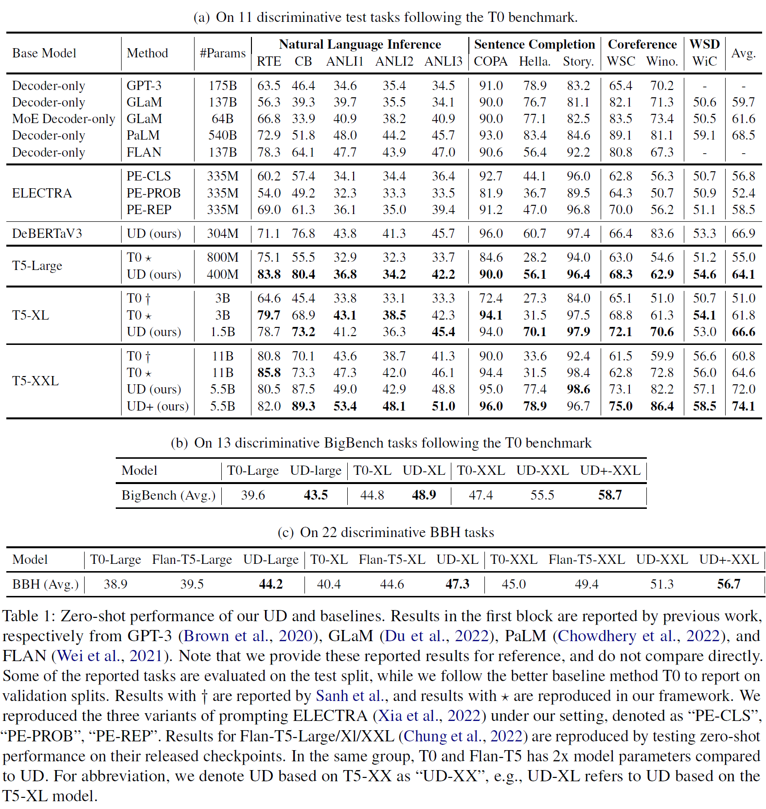

# README of UD

## How to reproduce our results

First, you need to get a universal discriminator. You can either retrain using our uploaded training data and code or directly download our released checkpoint.

### Method 1: Retrain UD using our training data

Download and unzip our training data (T0 training data sets with minimal prompts) and evaluation data (T0 evaluating data sets) and put them in folders "train_data" and "eval_data" respectively.

Then, train our main model (i.e., Universal Discriminator).

You can directly use the following script:

```python
bash train.sh
```

Or you can run by changing some of the parameters for usage:

```python
NUM_GPUS=8

deepspeed --num_gpus=${NUM_GPUS} train.py \
    --model_name_or_path ./huggingface_models/t5-large-lm-adapt \
    --train_file ./train_data/data_cls_5choices_maxlen256.json \
    --output_dir ./results/ud_large \
    --num_train_epochs 10 \
    --per_device_train_batch_size 16 \
    --gradient_accumulation_steps 2 \
    --learning_rate 1e-5 \
    --max_seq_length 256 \
    --pooler_type avg \
    --overwrite_output_dir \
    --do_train \
    --max_choices 60 \
    --deepspeed ./deepspeed/ds_config_zero2_fp32.json  \
    "$@"
```

### Method 2: directly download our released UD checkpoint

You can directly download our released UD checkpoint through the link we provide.

### Evaluate UD using our uploaded checkpoint

Download and unzip our training data (T0 training data sets with minimal prompts) and evaluation data (T0 evaluating data sets) and put them in folders "train_data" and "eval_data" respectively.

You can directly use the following script to evaluate UD on T0 benchmark:

```python
bash eval.sh
```

Or you can run by changing some of the parameters for usage:

```python
write_dir="./evaluation_results/ud_large"

mkdir -p ${write_dir}

python eval.py \
    --model_name_or_path results/ud_large/ \
    --write_path ${write_dir}/final.csv \
    --pooler_type avg \
    "$@"
```

The evaluation results should be able to match our claimed results for UD with T5-large on T0 benchmark in our main table.



## How to apply UD to other tasks

Our UD has the ability to judge whether a sentence comes from true language distribution or not and thus has many potential applications. See our usages and examples in discriminator_demo.py

You can directly use the following script to our demo.

```python
bash run_discriminator.sh
```

Here are some prediction examples:

## Released training data, eval data, and checkpoint

Our released training data, eval data, and checkpoint can be found through this link:

### Dataset

You can download them through the following link:

https://www.dropbox.com/s/t5c9ms2g8s1re4r/ud_data.zip?dl=0

### Model

You can download model through this link:

https://www.dropbox.com/s/2lvey1js4adq5w4/ud_ckpt.zip?dl=0

## Acknowledgement

Some part of our code is adapted from [SimCSE](https://github.com/princeton-nlp/SimCSE)

## TODO LIST
    - release XL and XXL checkpoint of our proposed Universal Discriminator
    - Our proposed Universal Discriminator can be regarded as a strong reward model for the RLHF (Reinforcement learning from human feedback) for open source chatgpt like LLAMA (https://github.com/facebookresearch/llama), etc.
    

## Citation
Please cite us if it is useful in your work:
```
@article{xu2022universal,
  title={A Universal Discriminator for Zero-Shot Generalization},
  author={Xu, Haike and Lin, Zongyu and Zhou, Jing and Zheng, Yanan and Yang, Zhilin},
  journal={arXiv preprint arXiv:2211.08099},
  year={2022}
}
```
